# 🐧 penguin-colony

> **Visualize your GitHub repos as an adorable penguin colony.**
> Stars → size. Language → scarf. Activity → pose. Fork → ghost.

<div align="center">


[](LICENSE)
[](https://python.org)
[](#)
[](https://github.com/Penguin-Life/penguin-colony)

</div>

---

## ✨ What is this?

`penguin-colony` turns your GitHub profile into a living, breathing colony of penguins — each one representing a repository. Embed it in your profile README for an instant conversation-starter.

Every penguin encodes real data:

| Visual | Meaning | Details |
|--------|---------|---------|
| 📏 **Size** | Stars | Little Blue → Adélie → King → Emperor |
| 🧣 **Scarf color** | Primary language | 20+ languages mapped |
| 🏊 **Pose** | Recent activity | Swimming → Walking → Standing → Sleeping |
| 👻 **Opacity** | Fork status | Forks appear translucent |

The background is a procedurally-generated Antarctic night scene — aurora borealis, falling snow, twinkling stars, and an ice shelf — all in pure SVG, no images.

---

## 🚀 Quick Start

```bash
# No install needed — pure Python stdlib, no dependencies
python3 colony.py <github-username> -o colony.svg
```

### Examples

```bash
# Your own profile
python3 colony.py torvalds -o colony.svg

# Limit to top 20 repos
python3 colony.py vercel -n 20 -o colony.svg

# Include forked repos too
python3 colony.py octocat --forks -o colony.svg

# Use a GitHub token (avoids rate limits)
GITHUB_TOKEN=ghp_xxx python3 colony.py your-username -o colony.svg

# Output raw JSON (repo data)
python3 colony.py your-username --json
```

---

## 📸 Gallery

| User | Preview |
|------|---------|
| Penguin-Life |  |
| vercel (top 20) |  |

---

## 🎨 Visual Encoding

### 🐧 Penguin Sizes (Stars)

| Tier | Stars | Scale |
|------|-------|-------|
| 🔵 Little Blue | < 10 | 0.7× |
| 🐧 Adélie | 10–99 | 0.9× |
| 👑 King | 100–999 | 1.1× |
| 🏔️ Emperor | 1000+ | 1.4× |

### 🧣 Scarf Colors (Language)

The scarf glows in your repo's primary language color — same palette as GitHub's language dots.

`JavaScript` 🟡 · `TypeScript` 🔵 · `Python` 🔷 · `Rust` 🟠 · `Go` 💠 · `Ruby` 🔴 · `Swift` 🟥 · and 14 more...

### 🏊 Poses (Activity)

| Pose | Days Since Push | Vibe |
|------|----------------|------|
| 🏊 Swimming | ≤ 7 days | Actively maintained |
| 🚶 Walking | 8–30 days | Recent activity |
| 🧍 Standing | 31–180 days | Stable / dormant |
| 💤 Sleeping | 180+ days | Archived / forgotten |

Sleeping penguins get little `z z z` floating above their heads. 🥹

---

## 📌 Add to Your GitHub Profile README

### Option 1: GitHub Actions (auto-updates daily)

Add this workflow to your profile repo (the `<username>/<username>` repo):

```yaml
# .github/workflows/colony.yml
name: Update Penguin Colony

on:
  schedule:
    - cron: '0 6 * * *'   # daily at 06:00 UTC
  push:
    branches: [main]
  workflow_dispatch:

jobs:
  update:
    runs-on: ubuntu-latest
    steps:
      - uses: actions/checkout@v4

      - name: Generate colony
        env:
          GITHUB_TOKEN: ${{ secrets.GITHUB_TOKEN }}
        run: |
          curl -fsSL https://raw.githubusercontent.com/Penguin-Life/penguin-colony/main/colony.py -o colony.py
          python3 colony.py ${{ github.repository_owner }} -o colony.svg

      - name: Commit SVG
        run: |
          git config user.name "github-actions[bot]"
          git config user.email "github-actions[bot]@users.noreply.github.com"
          git add colony.svg
          git diff --cached --quiet || git commit -m "🐧 Update penguin colony"
          git push
```

Then in your README:

```markdown

```

### Option 2: Use this repo's Action directly

See [`.github/workflows/colony.yml`](.github/workflows/colony.yml) for a ready-to-go workflow.

---

## ⚙️ CLI Reference

```
usage: colony.py [-h] [-o OUTPUT] [-n MAX_REPOS] [--forks] [--token TOKEN] [--json] username

positional arguments:
  username              GitHub username or org

options:
  -o, --output FILE     Output SVG file (default: stdout)
  -n, --max-repos N     Max repos to display (default: 50)
  --forks               Include forked repos (shown as ghosts)
  --token TOKEN         GitHub API token (or set GITHUB_TOKEN env var)
  --json                Output repo data as JSON instead of SVG
```

---

## 🛠 How It Works

1. Fetches all public repos via GitHub REST API (paginated, no auth needed for public data)
2. Sorts by stars descending
3. Maps each repo → penguin with procedural SVG
4. Lays out in a responsive grid
5. Renders a full Antarctic scene as pure SVG (aurora, snow, stars, ice terrain — all animated)

Everything runs in pure Python 3.8+ with **zero external dependencies**.

---

## 🤝 Contributing

PRs welcome! Some ideas:

- 🌍 More language → color mappings
- 🏔️ Different terrain modes (beach? jungle?)
- 📊 Org-level views (group repos by topic)
- 🎭 More poses / expressions

---

## 📄 License

[MIT](LICENSE) — © 2026 Penguin-Life

---

<div align="center">

Made with ❄️ and 🐧 by [Penguin-Life](https://github.com/Penguin-Life)

*If this made you smile, give it a ⭐ — it helps little penguins find their forever homes.*

</div>
